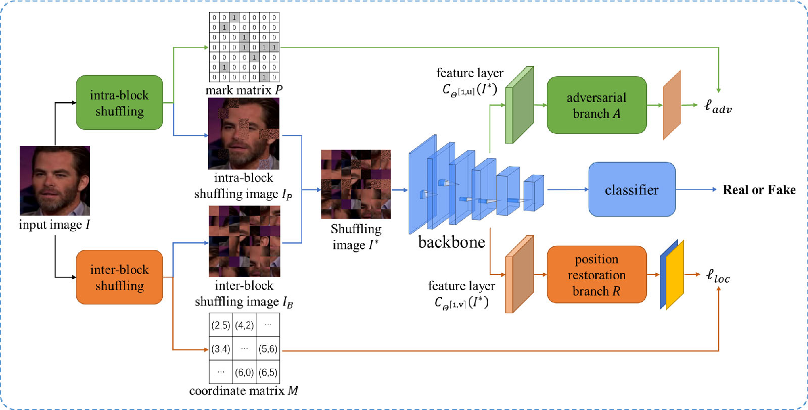

# Block shuffling learning for Deepfake Detection

Although deepfake detection methods based on convolutional neural network (CNN) achieve good accuracy, results illustrate that the performance degrades significantly when images undergo some common transformations (like resizing and blurring). We identify this as the overfitting problem mainly caused by unstable local regions and propose a novel block shuffling regularization method to solve it. Firstly, we divide the images into blocks and perform intra-block and inter-block shuffling to achieve weight-sharing across different dimensions indirectly. Secondly, we propose an adversarial loss algorithm to overcome the overfitting problem brought by the shuffling noise. Finally, we restore the spatial layout of the blocks to model the semantic associations between them. Especially our method can be easily integrated with various CNN models. Extensive experiments show that our proposed method achieves state-of-the-art performance in forgery face detection, including good generalization ability in the face of common image transformations.

